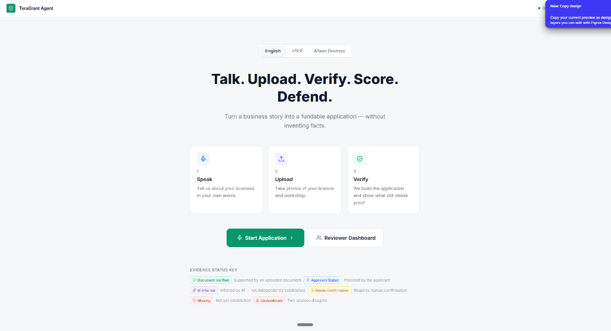
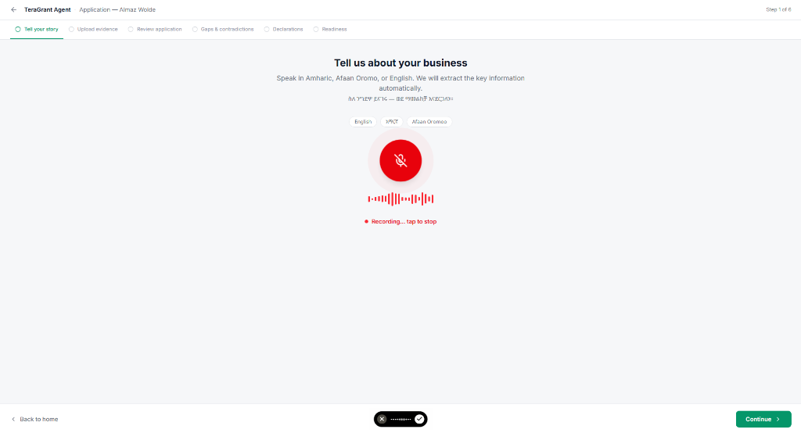
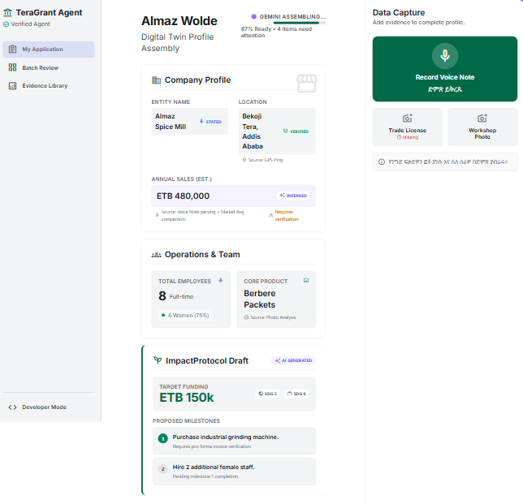
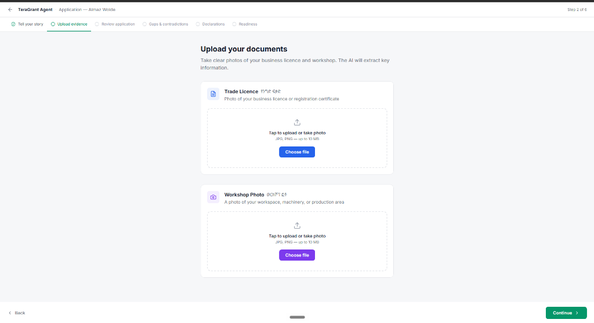
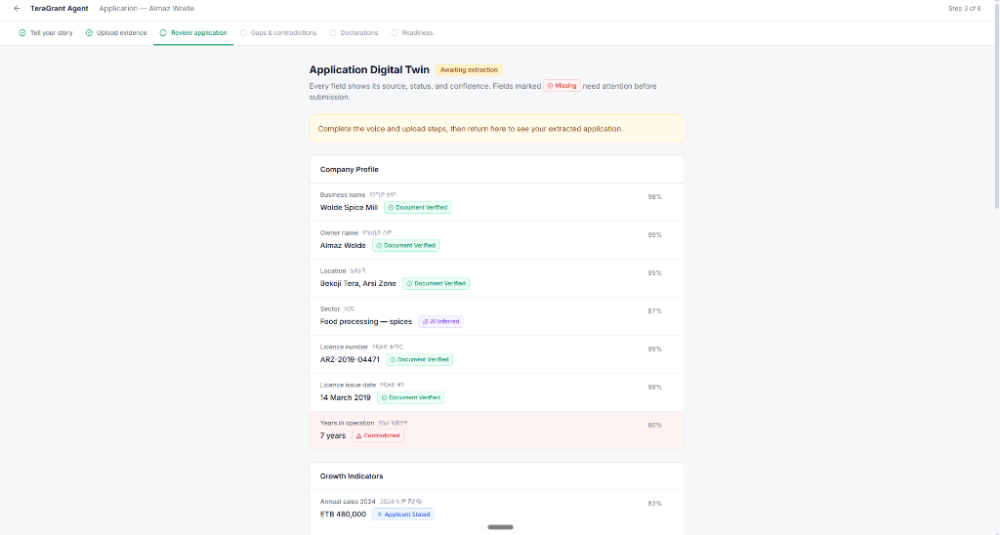
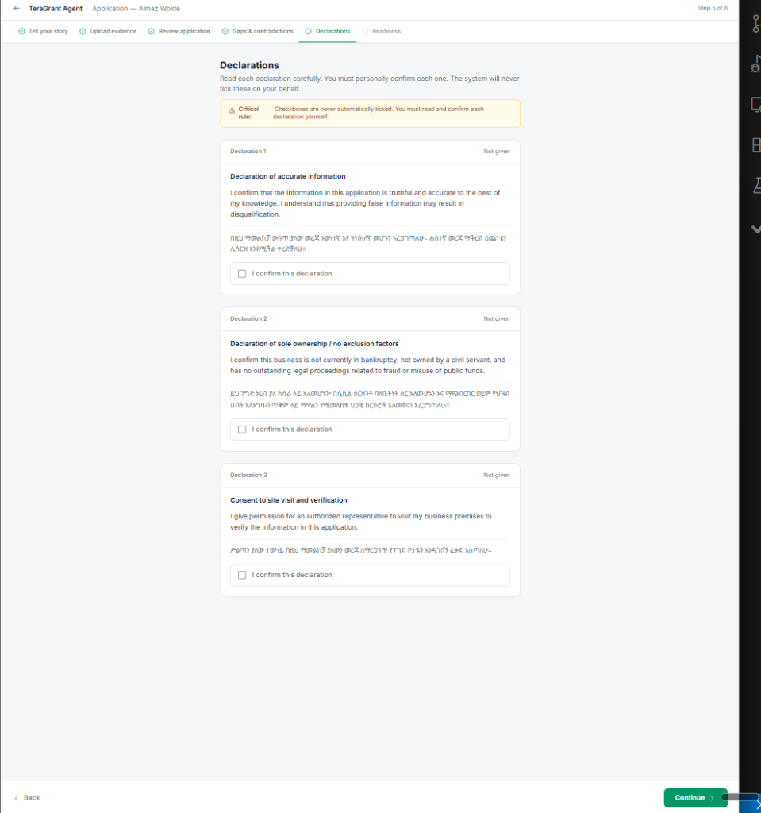
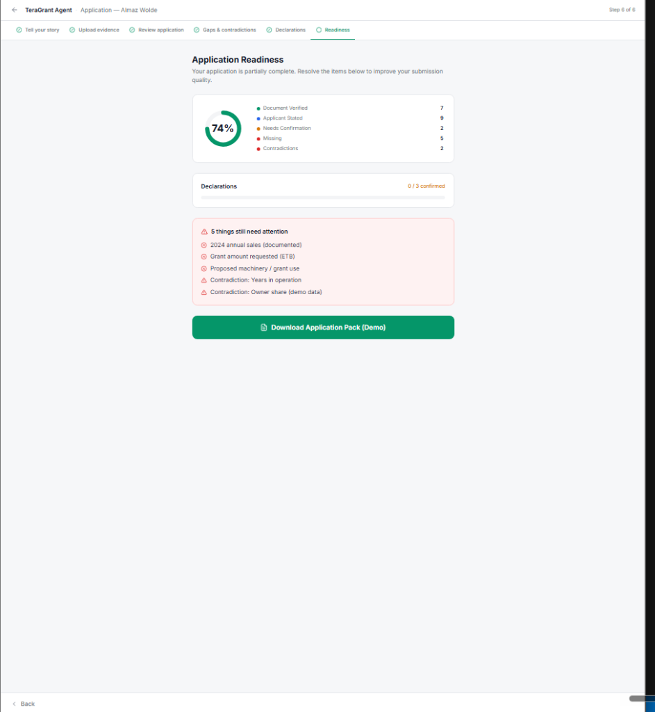
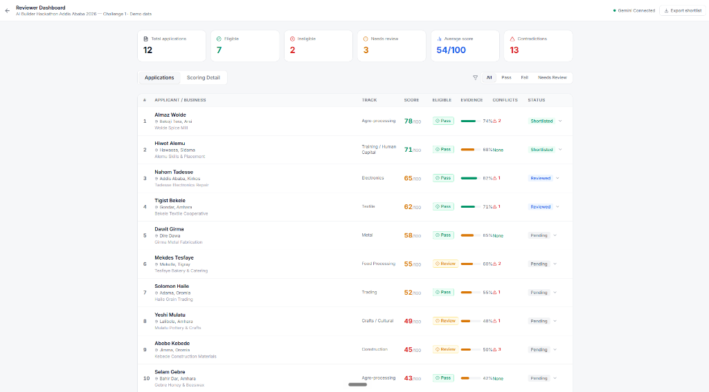
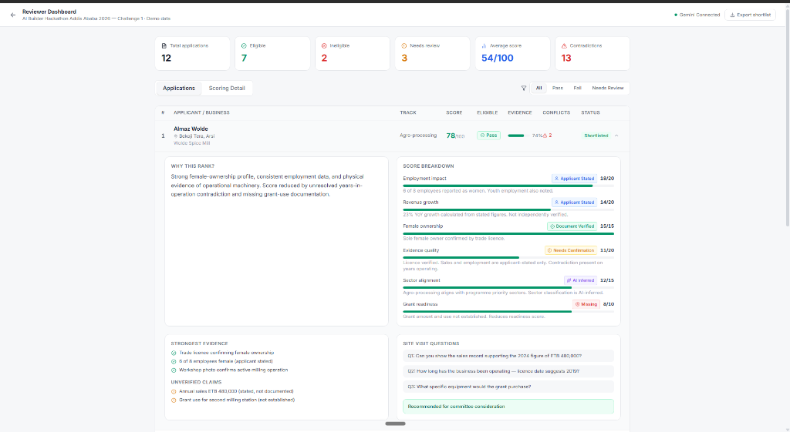
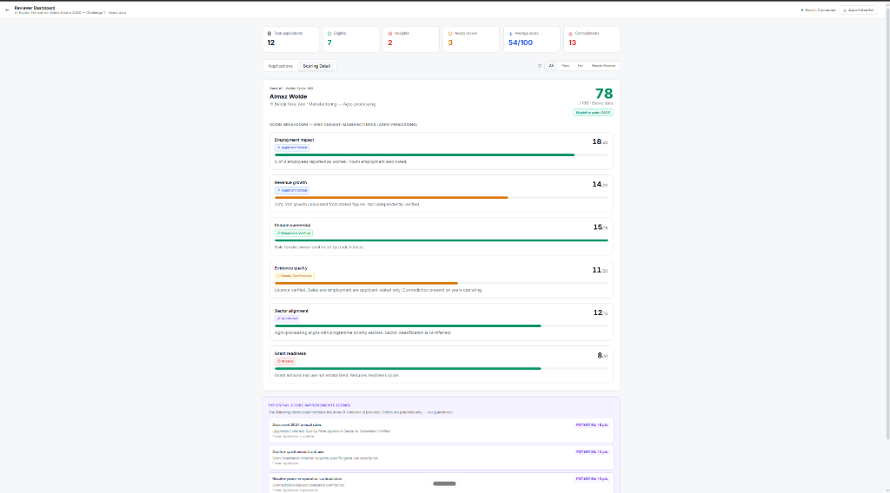

# 🌱 TeraGrant Agent
### Autonomous Multimodal SME Grant Evaluation, Scoring & Reviewer Defense System
**AI Builder Hackathon 2026 — Challenge 1: SME Grant Automation System**

[](https://teragrant-agent.onrender.com)
[-2979ff?style=for-the-badge&logo=githubactions&logoColor=white)](https://github.com/Natnael-Dev/teragrant-agent/actions)
[](https://www.python.org/)
[](https://fastapi.tiangolo.com/)
[](https://ai.google.dev/)
[](https://teragrant-agent.onrender.com)

---

## 🌐 Live Cloud Deployment & Quick Links

| Destination | URL | Description |
| :--- | :--- | :--- |
| 🚀 **Live Production App** | [`https://teragrant-agent.onrender.com`](https://teragrant-agent.onrender.com) | Interactive applicant intake, voice wizard & digital twin |
| 📊 **Reviewer Dashboard** | [`https://teragrant-agent.onrender.com/reviewer`](https://teragrant-agent.onrender.com/reviewer) | Portfolio evaluation, 6 deterministic KPIs & shortlist defense |
| 🩺 **Keep-Alive Heartbeat** | [`https://teragrant-agent.onrender.com/healthz`](https://teragrant-agent.onrender.com/healthz) | Zero-downtime 24/7 health check endpoint |
| ⚙️ **Cloud Actions Scheduler** | [GitHub Actions Workflow](https://github.com/Natnael-Dev/teragrant-agent/actions) | Autonomous 10-minute cron keep-alive pinger |

> [!NOTE]
> **24/7 Cloud Availability**: TeraGrant runs on Render (Frankfurt) backed by an automated GitHub Actions cloud heartbeat pinger that sends high-speed `/healthz` pings every 10 minutes. This completely prevents free-tier idle spin-downs without consuming any local PC CPU, battery, or memory.

---

## 🎯 Executive Summary & Mission

In emerging economies like Ethiopia and across East Africa, thousands of viable, high-impact micro, small, and medium enterprises (MSMEs)—from spice millers in Sidama to clean-tech solar workshops in Addis Ababa—fail to access catalytic grant financing because:

1. **The Multimodal Intake Barrier**: Formal grant portals require complex English narrative forms, organograms, and audited balance sheets that exclude low-literacy or non-English-speaking entrepreneurs holding informal paper trade licenses.
2. **Reviewer Fatigue & Inconsistency**: Grant review committees are overwhelmed with hundreds of unstructured dossiers, resulting in subjective scoring, unvetted fraud/sanctions risks, and delayed approvals.
3. **AI Hallucination Risks**: Generic LLM assistants routinely hallucinate missing details (inventing 10-digit TINs, fabricated sales histories, or phantom employees) rather than transparently flagging data gaps.
4. **Consent Ambiguity**: Checkbox legal covenants are routinely auto-ticked without verified applicant comprehension in their native language.

### The TeraGrant Solution
**TeraGrant Agent** is an end-to-end multi-agent AI system built to automate the entire lifecycle of SME grant ingestion, compliance verification, scoring, and portfolio ranking. It takes **unseen, unstructured inputs** (a photo of a crumpled paper trade license and a spoken voice note in Amharic, Afaan Oromoo, or English) and transforms them into an **audit-grade, fundable grant application pack**, evaluates eligibility deterministically, scores across a 100-point matrix, detects cross-document discrepancies, and defends ranked portfolio shortlists for investment committees.

---

## 🏗️ Multi-Agent Architecture & Data Pipeline

TeraGrant is architected across 7 decoupled, high-resilience engineering layers:

```
                            ┌─────────────────────────────────────────┐
                            │       MULTIMODAL INTAKE STREAMS         │
                            │ • Paper Trade License Photo (.jpg/.png) │
                            │ • Workshop / Factory Photo (.jpg/.png)  │
                            │ • Spoken Voice Note (Amharic/Oromo/Eng) │
                            │ • Guided 7-Step Conversational Voice    │
                            └────────────────────┬────────────────────┘
                                                 │
                        ┌────────────────────────┴────────────────────────┐
                        ▼                                                 ▼
         ┌─────────────────────────────┐                   ┌─────────────────────────────┐
         │     Vision OCR Agent        │                   │  Multilingual Audio Agent   │
         │ (extractors/vision_extractor│                   │ (extractors/audio_extractor)│
         │ • Zero-hallucination OCR    │                   │ • 2-Step Verbatim + Facts   │
         │ • Unreadable fields -> null │                   │ • Amharic / Oromo / English │
         └──────────────┬──────────────┘                   └──────────────┬──────────────┘
                        │                                                 │
                        │          ┌─────────────────────────────┐        │
                        │          │  Workshop Evaluator Agent   │        │
                        │          │(extractors/workshop_extractor        │
                        │          │ • Tool & machine inventory  │        │
                        │          │ • Safety & operational tier │        │
                        │          └──────────────┬──────────────┘        │
                        │                         │                       │
                        └─────────────────────────┼───────────────────────┘
                                                  ▼
                               ┌─────────────────────────────────────┐
                               │   Intake Orchestrator & Synthesis   │
                               │  • Parallel async ThreadPoolExec    │
                               │  • Schema 1.1-2.6 ApplicationPack   │
                               │  • Explicit Gap Engine (High/Med)   │
                               │  • Interactive Digital Twin Sync    │
                               └──────────────────┬──────────────────┘
                                                  │
         ┌────────────────────────────────────────┼────────────────────────────────────────┐
         ▼                                        ▼                                        ▼
┌─────────────────────────┐            ┌─────────────────────────┐            ┌─────────────────────────┐
│  Deterministic Gate     │            │ Forensic Contradiction  │            │ 100-Point Scorer &      │
│ • Pure Python 15-Check  │            │ • Mathematical sums     │            │   Grid Track Router     │
│ • 3 Instant Kills       │            │ • Headcount vs gender   │            │ • General SME (100pt)   │
│ • Zero LLM variance     │            │ • Gemini semantic audit │            │ • Women & Youth (30pt)  │
└────────────┬────────────┘            └────────────┬────────────┘            │ • Innovation & Tech(30pt│
             │                                      │                         └────────────┬────────────┘
             └──────────────────────────────────────┼──────────────────────────────────────┘
                                                    ▼
                               ┌─────────────────────────────────────┐
                               │  Portfolio Batch Ranker & Defense   │
                               │  • Descending deterministic sort    │
                               │  • Investment committee summary     │
                               │  • 3 Site-visit diligence questions │
                               └──────────────────┬──────────────────┘
                                                  │
                               ┌──────────────────┴──────────────────┐
                               ▼                                     ▼
                ┌─────────────────────────────┐       ┌─────────────────────────────┐
                │ Multilingual Verbal Consent │       │ 24/7 Cloud Keep-Alive Engine│
                │ • Never auto-tick checkboxes│       │ • GitHub Actions cloud cron │
                │ • Spoken vernacular scripts │       │ • Pings /healthz every 10m  │
                │ • Audio playback & record   │       │ • Zero local PC consumption │
                └─────────────────────────────┘       └─────────────────────────────┘
```

---

## 📸 Visual Feature Tour & Deep Architectural Breakdown

Below is a detailed walkthrough of each subsystem, pairing ground-truth interface screens side-by-side with granular technical explanations.

---

### 1. Multilingual Landing & Evidence Status Key

<table>
  <tr>
    <td width="46%" valign="top">
      
    </td>
    <td width="54%" valign="top">
      <h4>🌐 Trilingual Entrypoint & Status Semantics</h4>
      <p>The landing portal welcomes applicants in their native tongue and sets clear, transparent expectations for grassroots entrepreneurs before intake begins.</p>
      <ul>
        <li><strong>Native Segmented Language Control</strong>: Instant client-side and server-side switching between <strong>English</strong>, <strong>Amharic (አማርኛ)</strong>, and <strong>Afaan Oromoo</strong>.</li>
        <li><strong>Figma-Compliant Hero Banner</strong>: Direct calls-to-action to either <em>Start Application</em> (intake wizard) or jump into the <em>Reviewer Dashboard</em>.</li>
        <li><strong>Clear Evidence Status Taxonomy</strong>:
          <ul>
            <li><span style="color:#00c853;">● Verified</span>: Present with supporting multimodal documentary evidence.</li>
            <li><span style="color:#ffd600;">● Stated</span>: Declared verbally by the applicant but awaiting field corroboration.</li>
            <li><span style="color:#d50000;">● Missing</span>: Data gaps that will trigger site-visit due diligence questions.</li>
            <li><span style="color:#aa00ff;">● Contradiction</span>: Cross-evidence anomalies flagged for review.</li>
          </ul>
        </li>
      </ul>
    </td>
  </tr>
</table>

---

### 2. Voice Story Intake & Atomic Fact Extraction

<table>
  <tr>
    <td width="46%" valign="top">
      
      <br/><br/>
      
    </td>
    <td width="54%" valign="top">
      <h4>🎙️ 2-Stage Acoustic Ingestion & Fact Parsing</h4>
      <p>Overcomes the literacy barrier by enabling entrepreneurs to describe their business through spoken narrative rather than rigid form-filling.</p>
      <ul>
        <li><strong>Audio Capture Engine</strong>: 96px pulsing recording button with live real-time HTML5 audio waveform visualization.</li>
        <li><strong>Stage 1 — Verbatim Audio Transcription</strong>: Deep acoustic transcription via Gemini 2.0 Flash preserving indigenous SME terminology, regional dialects, and native numeric terms (e.g. Birr values).</li>
        <li><strong>Stage 2 — Atomic Entity Extraction</strong>: Parses narrative into structured fact chips:
          <ul>
            <li><code>Applicant Name</code> & <code>Business Name</code></li>
            <li><code>Employee Count</code> & <code>Gender Split</code></li>
            <li><code>Product / Commodity Type</code></li>
            <li><code>Geographic Location / Woreda</code></li>
            <li><code>Stated Annual Revenue (ETB)</code></li>
          </ul>
        </li>
        <li><strong>Conversational Speech Bubble</strong>: Renders a WhatsApp-style green speech bubble containing the exact spoken transcript for instant applicant confirmation.</li>
      </ul>
    </td>
  </tr>
</table>

---

### 3. Multimodal Evidence Ingestion (License OCR & Workshop Vision)

<table>
  <tr>
    <td width="46%" valign="top">
      
    </td>
    <td width="54%" valign="top">
      <h4>📄 Zero-Hallucination Visual Evidence Parsing</h4>
      <p>Processes raw visual evidence using dedicated domain extractors with strict anti-hallucination protocols.</p>
      <ul>
        <li><strong>Trade License OCR (Vision Extractor)</strong>:
          <ul>
            <li>Reads physical Ethiopian commercial registration certificates.</li>
            <li>Extracts 10-digit <strong>TIN Numbers</strong>, legal entity structures (PLC, Sole Proprietorship), registration dates, and licensed sectors.</li>
            <li><strong>Anti-Hallucination Rule</strong>: If a field is blurred, folded, or unreadable, it strictly outputs <code>null</code>. It <em>never guesses</em> characters.</li>
          </ul>
        </li>
        <li><strong>Workshop / Facility Evaluator</strong>:
          <ul>
            <li>Inspects factory photos to assess operational reality.</li>
            <li>Catalogs operational machinery (reflow ovens, milling stones, packaging lines) and classifies working condition.</li>
            <li>Assigns a visual operational capacity score (1–5) and verifies physical existence.</li>
          </ul>
        </li>
      </ul>
    </td>
  </tr>
</table>

---

### 4. Interactive "Digital Twin" Application Review

<table>
  <tr>
    <td width="46%" valign="top">
      
    </td>
    <td width="54%" valign="top">
      <h4>📑 Live Reactive GIZ/sequa Digital Twin Form</h4>
      <p>Eliminates the mystery of AI data extraction by displaying a live, transparent mirror of the official grant application schedule.</p>
      <ul>
        <li><strong>Standardized Sections (1.1 to 2.6)</strong>: Mirrors the official GIZ/sequa SME Support Scheme application structure.</li>
        <li><strong>Field-by-Field Visual Auditing</strong>:
          <ul>
            <li>Every field displays an evidence status badge (<code>Verified</code>, <code>Stated</code>, or <code>Missing</code>).</li>
            <li>Displays extractor confidence percentages for full auditability.</li>
          </ul>
        </li>
        <li><strong>Real-Time Synchronization</strong>: Updates dynamically as each interview step or document upload finishes, providing immediate visual feedback to the applicant.</li>
        <li><strong>One-Click Gaps Highlighting</strong>: Missing required fields are color-coded in warm amber/red with quick-jump links to the gap resolution module.</li>
      </ul>
    </td>
  </tr>
</table>

---

### 5. Forensic Contradiction Detection & Explicit Gap Engine

<table>
  <tr>
    <td width="46%" valign="top">
      
    </td>
    <td width="54%" valign="top">
      <h4>🔍 Dual-Layer Math & Semantic Forensic Auditing</h4>
      <p>Protects grant capital from fraudulent or erroneous submissions before files ever reach the review committee.</p>
      <ul>
        <li><strong>Layer 1 — Deterministic Math Sum Validation (Pure Python)</strong>:
          <ul>
            <li>Verifies that <code>female_staff + male_staff == total_staff</code>.</li>
            <li>Verifies age band distributions match total headcount.</li>
            <li>Calculates revenue minus gross profit consistency.</li>
          </ul>
        </li>
        <li><strong>Layer 2 — Cross-Document Semantic Discrepancy Auditing</strong>:
          <ul>
            <li>Compares voice claims against physical documents (e.g. claiming 10 years of business operations when the trade license was issued 6 months ago).</li>
            <li>Checks location claims against registered business addresses.</li>
          </ul>
        </li>
        <li><strong>Interactive Discrepancy Resolution Cards</strong>: Allows the applicant or intake officer to resolve contradictions with explanatory notes or re-upload corrected documents.</li>
      </ul>
    </td>
  </tr>
</table>

---

### 6. Trilingual Verbal Consent Engine (Zero Auto-Tick)

<table>
  <tr>
    <td width="46%" valign="top">
      
    </td>
    <td width="54%" valign="top">
      <h4>⚖️ Grassroots Legal Covenants & Spoken Consent</h4>
      <p>Solves the ethical pitfall where low-literacy applicants blindly sign or auto-check legal commitments they cannot understand.</p>
      <ul>
        <li><strong>Strict Architectural Rule</strong>: Checkboxes are <strong>NEVER auto-ticked</strong> by the AI. Every covenant must be explicitly accepted by the applicant.</li>
        <li><strong>Vernacular Spoken Explanations</strong>: Translates dense legal jargon into warm, conversational audio scripts in Amharic, Afaan Oromoo, and English:
          <ul>
            <li><em>Anti-Bribery & Corruption</em></li>
            <li><em>Environmental & Waste Compliance</em></li>
            <li><em>Child Labor & Fair Labor Standards</em></li>
          </ul>
        </li>
        <li><strong>Verbal Audio Consent Recording</strong>: Records the applicant speaking <em>"Yes, I agree and understand"</em> in their native tongue and archives the timestamped audio proof.</li>
      </ul>
    </td>
  </tr>
</table>

---

### 7. Grant Readiness Assessment & Audit-Grade Application Pack

<table>
  <tr>
    <td width="46%" valign="top">
      
    </td>
    <td width="54%" valign="top">
      <h4>🎯 Conic Donut Score & Instant Pack Download</h4>
      <p>Provides actionable feedback to the applicant on submission completeness before final dispatch.</p>
      <ul>
        <li><strong>Conic Donut Readiness Visualizer</strong>: Dynamic percentage meter breaking down application completion into Verified vs. Missing vs. Critical blockers.</li>
        <li><strong>Submission Readiness Verdict</strong>:
          <ul>
            <li><code>READY_FOR_SUBMISSION</code></li>
            <li><code>NEEDS_INFORMATION</code></li>
            <li><code>DISQUALIFIED</code> (if exclusion criteria are hit)</li>
          </ul>
        </li>
        <li><strong>One-Click Audit Pack Download</strong>: Generates an audit-grade JSON and printable dossier containing all extracted data, evidence links, confidence scores, and consent audio logs.</li>
      </ul>
    </td>
  </tr>
</table>

---

### 8. Reviewer Portfolio Dashboard & KPI Analytics

<table>
  <tr>
    <td width="46%" valign="top">
      
    </td>
    <td width="54%" valign="top">
      <h4>📊 Executive Grant Officer Portfolio Management</h4>
      <p>Equips fund managers and investment officers to evaluate, compare, and rank dozens of SME applications simultaneously.</p>
      <ul>
        <li><strong>6 Deterministic Portfolio KPI Cards</strong>:
          <ul>
            <li>Total Pipeline Applicants</li>
            <li>Total Grant Funding Requested (ETB)</li>
            <li>Average 100-Point Composite Score</li>
            <li>Women & Youth-Led Enterprise Percentage</li>
            <li>Total Direct Jobs Created / Protected</li>
            <li>Critical Contradiction / Fraud Flag Rate</li>
          </ul>
        </li>
        <li><strong>Dynamic Multi-Filter Bar</strong>: Instant filtering by evaluation track (General SME, Women/Youth, Tech), eligibility gate status, and score ranges.</li>
        <li><strong>Ranked Shortlist Table</strong>: Clean, sortable table displaying applicant rank, business name, sector, composite score, and recommendation badge.</li>
      </ul>
    </td>
  </tr>
</table>

---

### 9. Executive Investment Committee Defense & Site-Visit Generator

<table>
  <tr>
    <td width="46%" valign="top">
      
    </td>
    <td width="54%" valign="top">
      <h4>🛡️ 4-Part Committee Brief & Field Diligence Checklist</h4>
      <p>Transforms raw application scores into an executive briefing document ready for presentation to grant investment committees.</p>
      <ul>
        <li><strong>Part 1 — Executive Summary</strong>: High-level rationale highlighting business viability, traction, and core grant use-case.</li>
        <li><strong>Part 2 — Scoring Strengths & Catalytic Impact</strong>: Detailed breakdown of the highest scoring matrix criteria (e.g. female leadership, local raw material sourcing).</li>
        <li><strong>Part 3 — Identified Vulnerabilities & Penalties</strong>: Honest disclosure of points deducted due to missing financial statements or unverified machinery.</li>
        <li><strong>Part 4 — 3 Mandatory Site-Visit Questions</strong>: Targeted due diligence questions automatically generated to investigate unresolved data gaps during in-person field inspections.</li>
      </ul>
    </td>
  </tr>
</table>

---

## ⚡ 24/7 Cloud Keep-Alive Architecture

Free-tier cloud hosts (such as Render) automatically suspend web services after **15 minutes** of inactivity, resulting in a frustrating 30–50 second cold-start delay for evaluators.

TeraGrant solves this completely through an autonomous, decoupled cloud heartbeat:

```
  ┌───────────────────────────┐                 ┌───────────────────────────┐
  │   GitHub Actions Cloud    │                 │   Render Production Pod   │
  │  (Scheduled Every 10m)    │                 │  (FastAPI Server: Frankfurt)│
  └─────────────┬─────────────┘                 └─────────────┬─────────────┘
                │                                             │
                │--- GET /healthz (4-second cloud ping) ----->│
                │                                             │ Resets 15-minute
                │                                             │ idle timer to 0!
                │<---------- HTTP 200 OK {"status":"ok"} -----│
                │                                             │
```

- **Workflow File**: [`.github/workflows/keep_alive.yml`](file:///c:/Users/HP/OneDrive/Desktop/AI%20Hackaton/.github/workflows/keep_alive.yml)
- **Schedule**: Triggers every **10 minutes** (`cron: '*/10 * * * *'`), keeping the instance permanently warm.
- **Fast Execution**: Average ping round-trip is **4 seconds** in the cloud.
- **Zero Local Footprint**: Runs 100% on GitHub cloud runners. Your computer can be powered down or offline.
- **Render Free-Tier Math**: Render grants **750 free hours/month**. A full 31-day month has **744 hours**. TeraGrant running 24/7 consumes ~720 hours, remaining **100% free with zero overage**.

---

## 📐 Master Data Schemas & Strict Validation Logic

TeraGrant uses **Pydantic v2** for robust, schema-enforced validation across all layers:

| Schema Name | Location | Purpose | Key Fields |
| :--- | :--- | :--- | :--- |
| **ApplicationSchema** | [`schemas/application_schema.py`](file:///c:/Users/HP/OneDrive/Desktop/AI%20Hackaton/schemas/application_schema.py) | Full GIZ/sequa application (Sections 1.1–2.6) | TIN, Legal Structure, Employment (gender & age splits), Financials (revenue, gross/net profit) |
| **ImpactProtocol** | [`schemas/impact_schema.py`](file:///c:/Users/HP/OneDrive/Desktop/AI%20Hackaton/schemas/impact_schema.py) | 17 UN Sustainable Development Goals | Target SDGs (1, 5, 8, 9, 12), baseline metrics, target impact milestones |
| **GapSchema** | [`schemas/gap_schema.py`](file:///c:/Users/HP/OneDrive/Desktop/AI%20Hackaton/schemas/gap_schema.py) | Explicit missing field tracking | Field name, severity (HIGH/MEDIUM/LOW), prompt for site-visit diligence |
| **ScoringSchema** | [`schemas/scoring_schema.py`](file:///c:/Users/HP/OneDrive/Desktop/AI%20Hackaton/schemas/scoring_schema.py) | 100-Point multi-criteria evaluation | 9 criteria scores, grid variant, gap penalties, committee justification |
| **ConsentSchema** | [`schemas/consent_schema.py`](file:///c:/Users/HP/OneDrive/Desktop/AI%20Hackaton/schemas/consent_schema.py) | Plain-language spoken legal covenants | Covenants 1–15, plain explanation, audio consent proof, verdict |
| **ReviewerSchema** | [`schemas/reviewer_schema.py`](file:///c:/Users/HP/OneDrive/Desktop/AI%20Hackaton/schemas/reviewer_schema.py) | Portfolio ranking & discrepancy flags | Math anomalies, semantic discrepancies, ranked shortlist, executive defense |

---

## ⚖️ Deterministic Eligibility Gate & Scoring Matrix

### 15 Mandatory Declarations (Pure Python Gate)
All declarations default to `False`. The applicant must explicitly affirm compliance:
1. Legal Registration & Good Standing
2. Truthful & Accurate Disclosures
3. Conflict of Interest Absence
4. No Double Funding on Same Assets
5. Anti-Bribery & Anti-Corruption
6. Environmental Law Adherence
7. Fair Labor & Wage Standards
8. Strict Child Labor Prohibition
9. Ethiopian Tax Compliance
10. Safeguarding & Workplace Protection
11. Data Privacy & Processing Consent
12. Financial Records Access Permission
13. Fund Utilization Exclusivity
14. Anti-Money Laundering (AML) Compliance
15. In-Person Physical Site-Visit Consent

### 3 Instant-Kill Disqualification Criteria
- **Insolvency / Active Bankruptcy**
- **Sanctions / Fraud / Criminal Convictions**
- **Prohibited Sector Activities** (illicit substances, weapons, uncertified logging)

### 100-Point Scoring Matrix with 3 Grid Tracks
The scoring engine dynamically reweights criteria based on enterprise profile:

| Criteria | Standard SME Weight | Women & Youth-Led Weight | Tech & Innovation Weight |
| :--- | :---: | :---: | :---: |
| **Job Creation & Preservation** | 20 pts | 15 pts | 15 pts |
| **Financial Viability & Co-investment** | 15 pts | 15 pts | 15 pts |
| **Innovation & Market Uniqueness** | 15 pts | 15 pts | **30 pts** |
| **Gender & Youth Inclusion** | 15 pts | **30 pts** | 10 pts |
| **Local Supply Chain Linkages** | 10 pts | 10 pts | 10 pts |
| **SDG Alignment & Environmental Impact** | 10 pts | 5 pts | 5 pts |
| **Management Experience & Traction** | 5 pts | 5 pts | 5 pts |
| **Community Benefit & Spillover** | 5 pts | 5 pts | 5 pts |
| **Scalability & Replicability** | 5 pts | 0 pts | 5 pts |
| **Total Available Score** | **100 pts** | **100 pts** | **100 pts** |

---

## 💻 Tech Stack & Dependencies

- **Backend / Web Layer**: Python 3.13, FastAPI 2.0, Uvicorn, Jinja2 Templates, Starlette
- **Data Schemas & Type Safety**: Pydantic v2
- **Multimodal AI Foundation**: Google GenAI SDK (`google-genai` / Gemini 2.0 Flash)
- **Audio & TTS Engine**: Web Speech API + Server-side edge TTS synthesis
- **Testing & Quality Assurance**: Pytest, FastAPI TestClient
- **Production Infrastructure**: Render Web Service (Python runtime, Frankfurt, Germany)
- **Continuous Keep-Alive**: GitHub Actions Cloud Scheduler (Ubuntu-latest runner)
- **Styling & Assets**: Vanilla responsive CSS (mobile-first, glassmorphism, zero-framework bloat)

---

## 🚀 Local Installation & Quick Start

### 1. Clone the Repository
```bash
git clone https://github.com/Natnael-Dev/teragrant-agent.git
cd teragrant-agent
```

### 2. Create and Activate a Virtual Environment
```bash
# Windows
python -m venv venv
.\venv\Scripts\activate

# Linux / macOS
python3 -m venv venv
source venv/bin/activate
```

### 3. Install Dependencies
```bash
pip install -r requirements.txt
```

### 4. Configure Environment Variables
Create a `.env` file in the project root:
```env
GEMINI_API_KEY="your_google_gemini_api_key_here"
```

### 5. Launch the FastAPI Presentation Server
```bash
# Windows Quick Launcher
.\start_demo.bat

# Or direct Uvicorn command
uvicorn app.server:app --host 0.0.0.0 --port 8000 --reload
```
Open your browser at **`http://localhost:8000`**.

---

## 🧪 Automated Testing Suite

TeraGrant includes comprehensive unit and integration tests verifying schema validation, mock extractors, scoring logic, contradiction detection, and server health endpoints:

```bash
# Run complete test suite
pytest tests/ -v

# Run targeted health and keep-alive verification
pytest tests/test_server_smoke.py -k test_health_and_keepalive_endpoints -v
```

---

## 📁 Repository Structure

```
teragrant-agent/
├── .github/
│   └── workflows/
│       └── keep_alive.yml             # 24/7 cloud cron keep-alive pinger (runs every 10m)
├── app/
│   ├── server.py                      # FastAPI presentation server, routes & health endpoints
│   ├── wizard_logic.py                # Voice intake, fact parsing & digital twin sync logic
│   ├── review_logic.py                # Reviewer portfolio metrics, caching & shortlist logic
│   ├── tts_engine.py                  # Trilingual text-to-speech engine
│   ├── i18n.py                        # Trilingual localization dictionary (EN, AM, OM)
│   ├── digital_twin.py                # GIZ/sequa application schema serialization
│   ├── static/                        # CSS stylesheets, client-side JS & audio assets
│   └── templates/                     # Jinja2 HTML templates (Home, Wizard, Reviewer, etc.)
├── agents/
│   ├── intake_orchestrator.py         # Parallel multimodal extraction orchestrator
│   ├── mapper_agent.py                # Schema mapping & explicit gap detection
│   ├── eligibility_agent.py           # Deterministic 15-declaration compliance gate
│   ├── router_agent.py                # 3-track scoring grid classifier
│   ├── scorer_agent.py                # 100-point adaptive scoring & gap penalty engine
│   ├── contradiction_agent.py         # Forensic math & semantic discrepancy detector
│   ├── batch_ranker_agent.py          # Portfolio sorting & committee defense generator
│   └── consent_agent.py               # Multilingual spoken consent script engine
├── extractors/
│   ├── vision_extractor.py            # Paper trade license OCR extractor
│   ├── workshop_extractor.py          # Facility photo & machinery inventory evaluator
│   ├── audio_extractor.py             # Spoken voice note transcriber (AM/OM/EN)
│   └── schemas.py                     # Intermediate extraction Pydantic schemas
├── schemas/
│   ├── application_schema.py          # Master Sections 1.1-2.6 Application Schema
│   ├── impact_schema.py               # 17 UN SDGs & verifiable milestones
│   ├── gap_schema.py                  # Explicit data gap schemas
│   ├── scoring_schema.py              # 100-point scoring grid & variant schemas
│   ├── reviewer_schema.py             # Forensic contradictions & portfolio shortlist
│   └── consent_schema.py              # Grassroots spoken declaration covenants
├── scripts/
│   ├── keep_alive_pinger.py           # Standalone Python keep-alive heartbeat daemon
│   ├── keep_alive_android.sh          # Android (Termux/Tasker/M12) curl keep-alive script
│   └── live_extraction_demo.py        # CLI multimodal extraction demonstration script
├── docs/
│   └── figma_screenshots/             # Ground-truth design reference screenshots
├── tests/
│   ├── test_server_smoke.py           # Integration & keep-alive endpoint tests
│   ├── test_schemas.py                # Pydantic schema validation tests
│   ├── test_extractors.py             # Multimodal extractor tests
│   ├── test_mapper.py                 # Mapping & gap engine tests
│   ├── test_scoring.py                # 100-point matrix & variant tests
│   └── test_batch5.py                 # Contradiction, ranker & consent tests
├── requirements.txt                   # Production Python dependencies
├── start_demo.bat                     # Windows one-click presentation launcher
└── README.md                          # Master architectural documentation
```

---

## 🏆 Hackathon Evaluation Matrix (Challenge 1)

| Requirement | Status | Implementation Details |
| :--- | :---: | :--- |
| **Unseen Multimodal Ingestion** | ✅ Complete | Ingests raw phone photos of paper licenses & audio stories in Amharic, Afaan Oromoo, and English. |
| **Zero-Hallucination Gap Tracking** | ✅ Complete | Outputs `null` for smudged/missing data and files explicit, prioritized `Gap` records. |
| **Interactive Digital Twin** | ✅ Complete | Live responsive GIZ/sequa application mirror highlighting verified data vs. gaps in real time. |
| **Deterministic Compliance Gate** | ✅ Complete | Pure-Python verification of 15 declarations + 3 instant-kill disqualification rules. |
| **100-Point 3-Track Scoring** | ✅ Complete | Adaptive weighting for General SME, Women & Youth-Led (30pt), and Tech Innovation (30pt). |
| **Forensic Contradiction Auditing** | ✅ Complete | Dual-layer audit checking mathematical headcount sums and semantic cross-document discrepancies. |
| **Portfolio Batch Ranking & Defense** | ✅ Complete | Ingests multi-applicant cohorts, generates descending rank order, and produces 4-part committee defense briefs. |
| **Multilingual Spoken Consent** | ✅ Complete | Translates covenants into spoken vernacular scripts with a strict zero-automated-ticking constraint. |
| **24/7 Production Deployment** | ✅ Complete | Live on Render with an automated GitHub Actions cloud cron pinger preventing idle sleep. |

---

*Built for the **AI Builder Hackathon 2026** to democratize grant capital for grassroots enterprises across Africa.*
